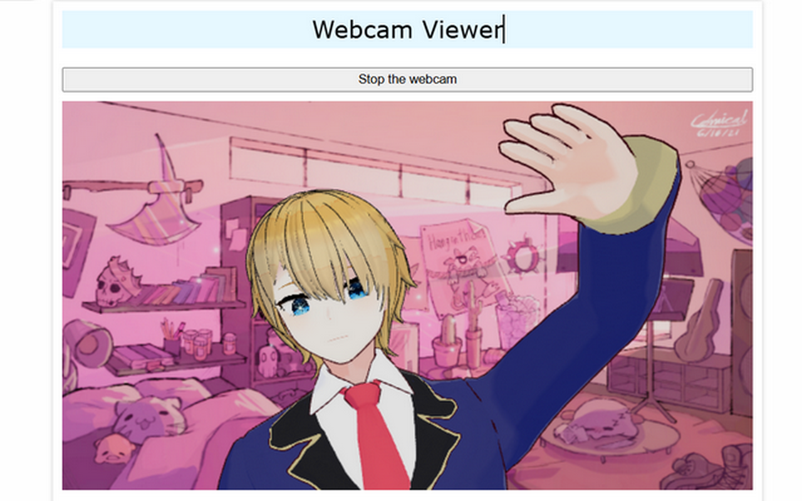

# VTuber Camera (+ extension)

VTuber Camera is a JavaScript library and browser extension that creates a virtual camera device for web applications. It leverages MediaPipe Holistic and Three.js to provide real-time avatar animation and video recognition.

## Features

- **Virtual Camera**: Adds a virtual video device accessible via `getUserMedia`, displaying a live animated avatar.
- **Holistic Recognition**: Uses MediaPipe Holistic to detect face, body, and hands from your webcam.
- **VRM Animation**: Animates a 3D VRM avatar based on detected movements.
- **Three.js Scene**: Manages 3D rendering, lighting, background, and post-processing effects.
- **MediaDevices Override**: Replaces native methods to integrate the virtual camera into device lists.
- **Customization**: Supports changing avatar, background, and camera source via the extension UI.

## Folder Structure: `extension/`

- `app.js`: Main entry point, instantiates and configures `VirtualCameraManager`.
- `background.js`: Background script for the extension.
- `content.js`: Injected script to activate the virtual camera in web pages.
- `manifest.json`: Chrome/Edge extension manifest.
- `popup.html` / `popup.js`: Extension popup interface.
- `register.js`: Script registration and permissions management.
- `worker.js`: Worker for asynchronous processing.
- `holistic/`: MediaPipe Holistic assets (models, wasm, etc.).
- `images/`: Extension icons.

## Installation

1. Clone the repository and install dependencies:
   ```powershell
   npm install
   ```
2. Build the extension:
   ```powershell
   npm run build
   ```
3. Load the `extension/` folder as an unpacked extension in Chrome/Edge.

## Usage

- Select the virtual camera in a compatible app (e.g., OBS, Discord).
- The avatar animates in real time based on your webcam movements.
- Customize avatar and background via the extension interface.

## Dependencies

- [Three.js](https://threejs.org/)
- [MediaPipe Holistic](https://google.github.io/mediapipe/solutions/holistic.html)
- [three-vrm](https://github.com/pixiv/three-vrm)
- [zustand](https://github.com/pmndrs/zustand)

## Customization

- Replace the VRM model in `models/`.
- Change the background in `extension/background.jpg` or via the UI.
- Extend scripts for more features (gestures, expressions, etc.).

## License

Open-source project. See `LICENSE` for details.

## Demo


https://fox3000foxy.github.io/vtuber-camera-javascript/

You can also find the extension on the Chrome Web Store:
[VTuber Camera Extension](https://chromewebstore.google.com/detail/afghmckjlpjhpmdgpkhnecekapjcnepk)

---